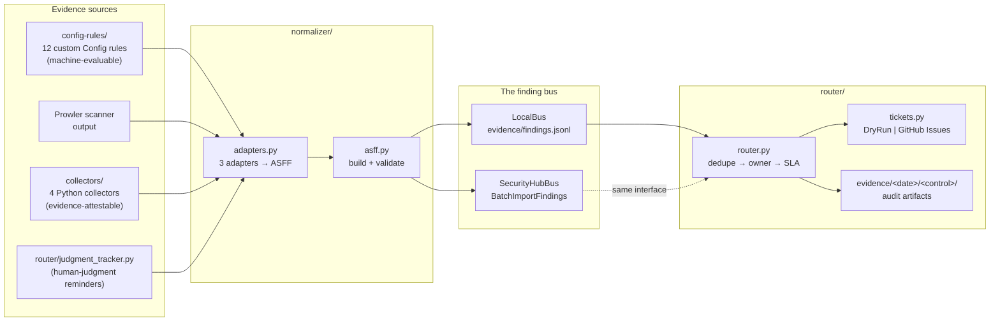

# 00 — Overview: the system in one sitting

## The problem this solves

Most compliance programs collect evidence the worst possible way: once a
year, by hand, in a panic, screenshotting consoles for an auditor. Between
audits, nobody knows whether controls actually hold. **Continuous control
monitoring (CCM)** inverts that: evidence is collected on a cadence by
machines wherever possible, failures become tickets with owners and SLAs the
day they appear, and the audit becomes a retrieval exercise instead of an
archaeology project.

The engineering trap is building it as N point solutions: a script per
control, each with its own output format, its own ticket logic, its own
storage. That works for 5 controls and collapses at 50 — every new control
means touching routing, ticketing, and evidence code. This repo demonstrates
the architecture that scales instead:

> **Many sources, one schema, one bus.** Adding a control means adding a
> source that emits the common format. The pipeline never changes.

## Architecture



Two properties make this scale:

1. **The schema boundary is at the source.** Each source's quirks
   (Config's wire format, Prowler's OCSF, a log file's three timestamp
   formats) are absorbed by its adapter. Downstream of
   [`normalizer/adapters.py`](../../normalizer/adapters.py), nothing knows or
   cares where a finding came from.
2. **The bus is an interface, not a service.** `LocalBus` (a JSONL file) and
   `SecurityHubBus` (the real AWS API) are interchangeable behind
   [`normalizer/bus.py`](../../normalizer/bus.py). Development and demos cost
   $0; the deploy story is the same code with a different bus.

## One finding, traced end to end

This is the whole system in one example. An S3 bucket without default
encryption, from detection to audit artifact — every snippet below is real
output, committed at
[`evidence/sample/config-rule_CCM-02_demo-data-lake.json`](../../evidence/sample/config-rule_CCM-02_demo-data-lake.json).

**Hop 1 — evaluation.** The CCM-02 rule logic
([`config-rules/src/s3_bucket_encryption/handler.py`](../../config-rules/src/s3_bucket_encryption/handler.py))
calls `get_bucket_encryption`, catches the not-found error code, and returns
a plain dataclass — no Config service, no ASFF, just the verdict:

```python
Evaluation(
    resource_type="AWS::S3::Bucket",
    resource_id="demo-data-lake",
    compliance="NON_COMPLIANT",
    annotation="CCM-02: bucket has no default encryption configuration.",
)
```

**Hop 2 — normalization.** `from_config_evaluation(evaluation, "CCM-02", account, region)`
looks CCM-02 up in the catalog and emits validated ASFF. Note what got
attached that the rule never knew: severity from the catalog, CSF/800-53
mappings, the deterministic `Id`:

```json
{
  "Id": "config-rule/CCM-02/demo-data-lake",
  "Title": "CCM-02: S3 buckets enforce default encryption",
  "Severity": { "Label": "MEDIUM" },
  "Compliance": { "Status": "FAILED" },
  "Resources": [{ "Type": "AWS::S3::Bucket", "Id": "demo-data-lake", "Region": "us-east-1" }],
  "ProductFields": {
    "ccm:source": "config-rule",
    "ccm:control_id": "CCM-02",
    "ccm:bucket": "machine",
    "ccm:csf": "PR.DS-1",
    "ccm:nist_800_53": "SC-28"
  }
}
```

**Hop 3 — the bus.** `LocalBus.publish()` appends that JSON as one line of
`evidence/findings.jsonl`. (In live mode, `SecurityHubBus` sends the
identical dict to `BatchImportFindings`.)

**Hop 4 — routing.** [`router/router.py`](../../router/router.py) sees
`Compliance.Status == FAILED`, resolves the owner for CCM-02 from
[`mappings/owners.yaml`](../../mappings/owners.yaml) (`cloud-platform`),
computes the SLA due date from severity (MEDIUM → 90 days), files a ticket
(dry-run here), and writes the audit artifact:

```json
"routing": {
    "owner": "cloud-platform",
    "sla_days": 90,
    "due": "2026-09-11",
    "ticket": "DRY-RUN-2",
    "routed_at": "2026-06-13T01:04:34.657609+00:00"
}
```

That artifact — finding plus routing decision, timestamped, under
`evidence/<date>/CCM-02/` — is the answer to an auditor's "show me the chain
for this failure." Detected → tracked → audit-ready, no human in the loop.

## The three-bucket model

Every control is sorted into exactly one bucket *before any code is
written*, by two questions ([ADR-003](../decisions.md)):

| Bucket | Test | What gets automated | In this repo |
|---|---|---|---|
| **1. Machine-evaluable** | Can a machine compute pass/fail from system state alone? | The entire evaluation | 12 custom Config rules ([ch. 02](02-config-rules.md)) |
| **2. Evidence-attestable** | No — but does a retrievable artifact prove the process ran? | Pulling + asserting on the artifact | 4 collectors ([ch. 04](04-collectors.md)) |
| **3. Human-judgment** | No artifact can prove it; a human must judge | Only the reminder + attestation tracking | 5 tracked controls ([ch. 05](05-router.md)) |

The boundary cases are where the judgment lives, and interviewers probe
exactly there:

- *"Access reviews occurred"* is **bucket 2, not 1**: a script can prove a
  review ticket closed this quarter; it cannot prove the reviewer scrutinized
  anything. A rule marking it COMPLIANT would overstate assurance — the
  failure mode that costs a program its auditor's trust.
- *"MFA enabled"* is **bucket 1, not 2**: collecting screenshots of state the
  API exposes is wasted human time in the other direction.
- Bucket 3 still flows through the same pipeline — the
  [judgment tracker](../../router/judgment_tracker.py) emits "attestation
  overdue" findings onto the same bus, so reminders get owners, SLAs, and
  audit trails like any machine finding. The automation is honest about what
  it proves; it just refuses to pretend judgment is computable.

## Why this build order

```
catalog → config rules → normalizer/bus → collectors → router → deploy
```

Each layer is independently testable before the next exists, which means the
test suite is green at every step of the build:

1. **Catalog first** ([ch. 01](01-foundation.md)) because everything joins to
   it — rules cite control IDs, adapters enrich from it, the router reads
   severities from it. Defining all 21 controls up front also forces the
   bucket-sorting discipline before code biases it.
2. **Rules before the normalizer** because pure
   `evaluate() → [Evaluation]` functions are testable with moto alone; they
   don't need anywhere to send findings yet.
3. **Normalizer before collectors** so collectors are born emitting the
   contract (`COLLECTOR_REQUIRED_KEYS`) instead of being retrofitted.
4. **Router last among the local layers** because it consumes everything —
   building it earlier means testing against imagined inputs.
5. **Deploy at the end** because it proves plumbing, not logic; the logic was
   already proven on moto for free ([ADR-002](../decisions.md)).

## Glossary

| Term | Meaning here |
|---|---|
| **ASFF** | AWS Security Finding Format — the JSON schema Security Hub ingests. Our "one schema." |
| **Security Hub** | AWS's finding aggregator. Our "one bus" in real deployments; a JSONL file stands in locally. |
| **AWS Config rule** | AWS service that evaluates resources for compliance. *Custom* rules run your Lambda; *managed* rules run AWS's logic. |
| **Configuration recorder** | The Config component that snapshots resource state. Change-triggered rules depend on it; our periodic rules don't (see CCM-11). |
| **CSF** | NIST Cybersecurity Framework — control IDs like `PR.DS-1` (data security), `PR.AC-7` (access control). |
| **NIST 800-53** | The detailed federal control catalog (`SC-28`, `IA-2(1)`); what conformance packs map to. |
| **moto** | Python library that mocks AWS APIs in-process. Our tests create "real" buckets/users/trails against it. |
| **OCSF** | Open Cybersecurity Schema Framework — Prowler v4's native output format; one of our three adapter inputs. |
| **Prowler** | Open-source AWS security scanner with NIST/CIS-mapped checks. |
| **Attestation** | A human formally affirming a judgment control was performed ("we reviewed the policy"), with an artifact. |
| **Evidence artifact** | The stored, timestamped proof a finding was detected and routed — what you hand an auditor. |
| **SLA** | Here: the committed time-to-remediate for a failed control, derived from severity. |

## What to read next

[Chapter 01](01-foundation.md) builds the foundation everything joins to:
the repo scaffold and the control catalog. Or jump to
[Chapter 03](03-normalizer.md) if you want the core idea first and the
scaffolding later.
